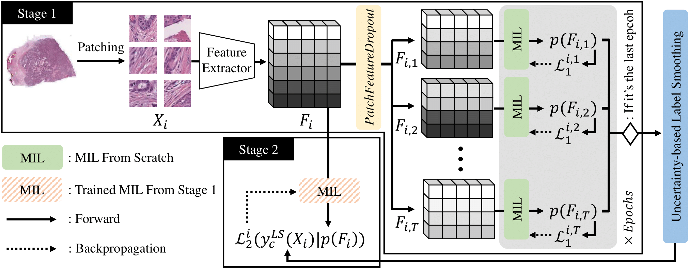

# Uncertainty-based Data-wise Label Smoothing for Calibrating Multiple Instance Learning in Histopathology Image Classification (2024)

The code for "Uncertainty-based Data-wise Label Smoothing for Calibrating Multiple Instance Learning in Histopathology Image Classification"

Run the code after extracting the patch features.

For the benchmark datasets, you can get the pre-trained patch features from the work of DTFD-MIL:

https://github.com/hrzhang1123/DTFD-MIL

@inproceedings{zhang2022dtfd,
  title={Dtfd-mil: Double-tier feature distillation multiple instance learning for histopathology whole slide image classification},
  author={Zhang, Hongrun and Meng, Yanda and Zhao, Yitian and Qiao, Yihong and Yang, Xiaoyun and Coupland, Sarah E and Zheng, Yalin},
  booktitle={Proceedings of the IEEE/CVF conference on computer vision and pattern recognition},
  pages={18802--18812},
  year={2022}
}

The specific guidelines for running the codes are presented in the subfolders.
